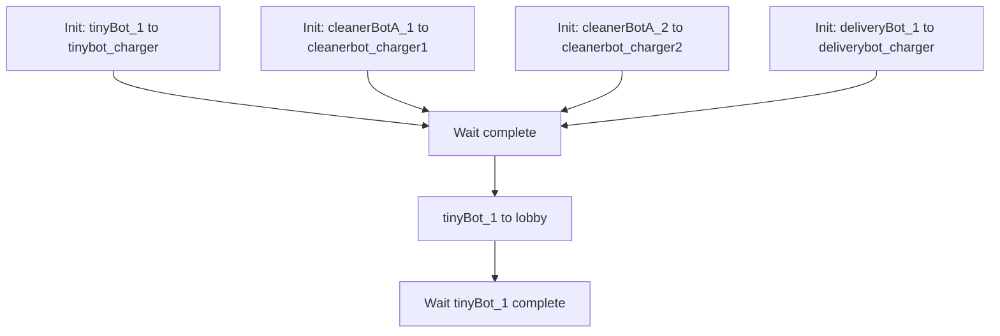
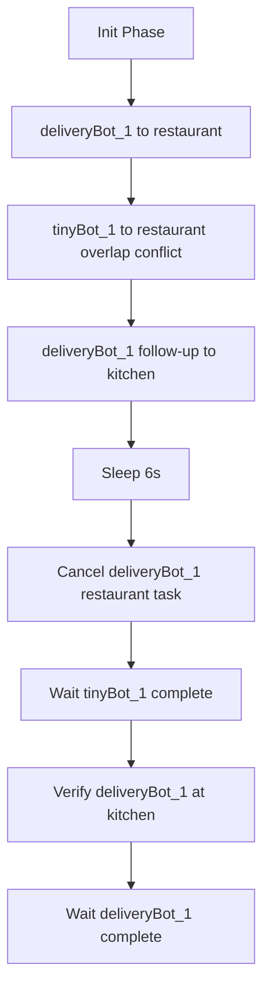
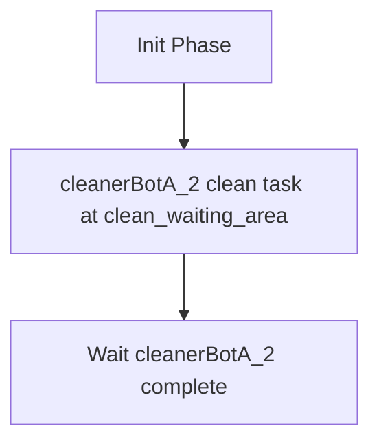
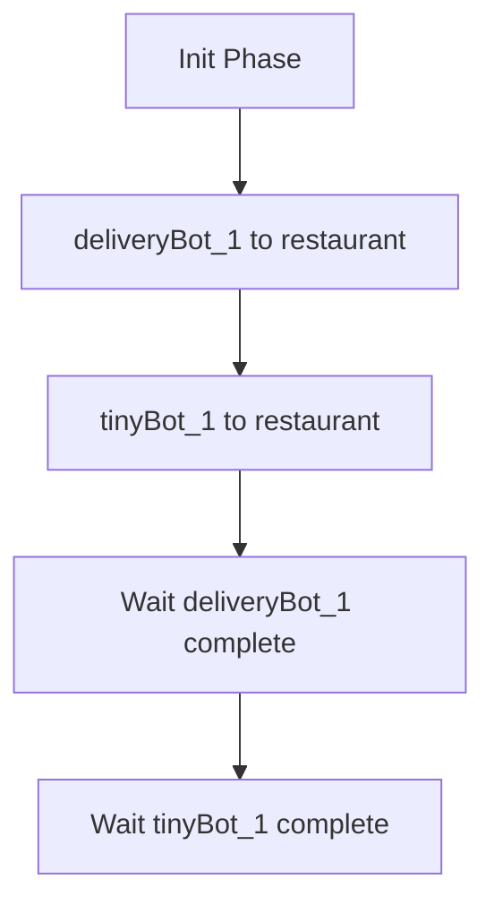
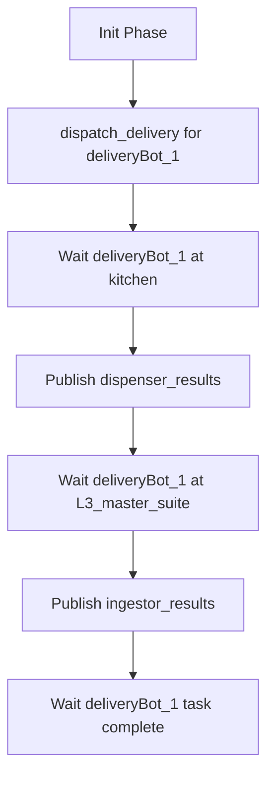
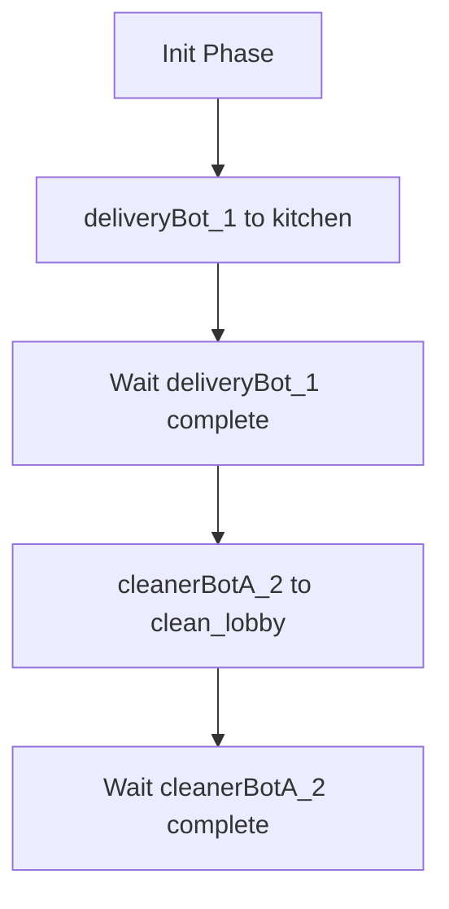
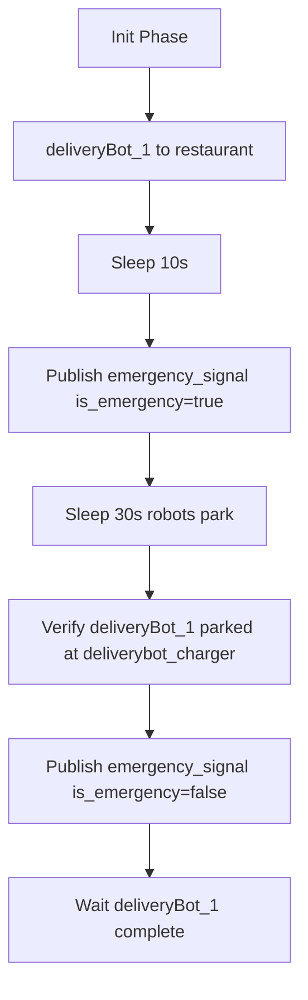
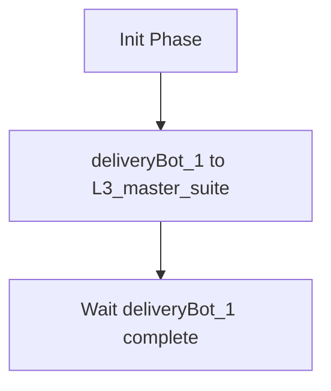
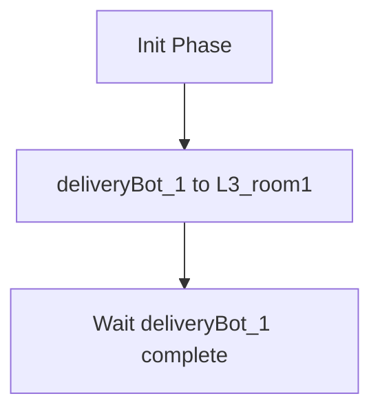
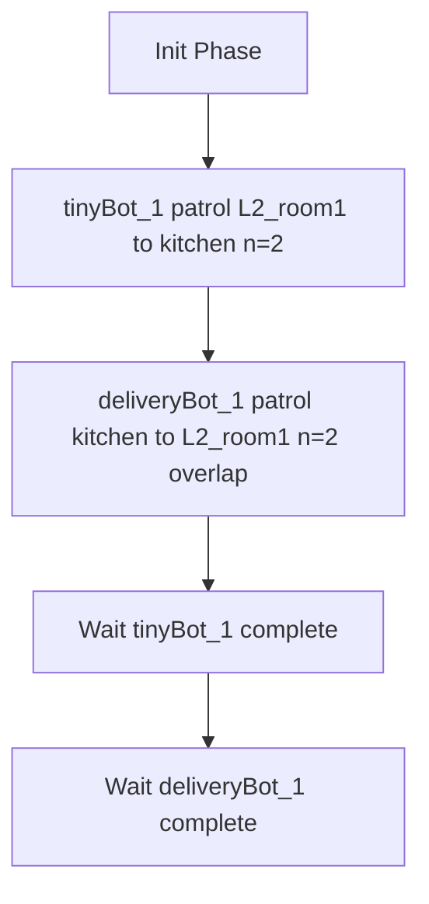

# Open-RMF High-Level Stress Tests

This folder contains bash scripts for high-level integration tests of Open-RMF. Each script initializes robots across different fleets (`tinyRobot`, `cleanerBotA`, `deliveryRobot`), dispatches tasks via `rmf_demos_tasks`, and verifies completion.

> [!NOTE]
> These stress tests are all based in `hotel` simulation.

## test_basic

Initializes all robots at their chargers, sends `tinyBot_1` to `lobby`, verifying that Open-RMF can plan and execute a basic navigation task seamlessly.

## test_cancellation

Creates a conflict by sending `deliveryBot_1` and then `tinyBot_1` to `restaurant`, followed by a task for `deliveryBot_1` to `kitchen`. Cancels `deliveryBot_1`'s first task halfway through, verifying that it immediately proceeds to `kitchen`, freeing up `restaurant` for `tinyBot_1`.

## test_clean

Verifies that the `cleanerBotA_2` robot can properly execute a specialized cleaning task by dispatching it to `clean_waiting_area` and waiting for completion.

## test_current_waitspot

Verifies correct wait-spot behavior by dispatching `deliveryBot_1` and `tinyBot_1` to the same constrained location (`restaurant`), ensuring Open-RMF can resolve traffic logic securely.

## test_delivery

Dispatches a delivery task between a dispenser at `kitchen` and ingestor at `L3_master_suite` for `deliveryBot_1`. Automatically checks robot location and artificially publishes the dispenser and ingestor task results to ensure the RMF integration workflow successfully runs end-to-end.

## test_door_interact

Tests physical object interactions securely by sending `deliveryBot_1` to `kitchen` and `cleanerBotA_2` to `clean_lobby`, forcing the navigation system to orchestrate opening and closing of doors safely along the routes.

## test_emergency_pullover

Initializes the robots, starts a patrol to `restaurant` for `deliveryBot_1`, and triggers an emergency alarm to force pullover behaviors. Disables the alarm afterwards to ensure the robot gracefully resumes operations.

## test_lift_door_interact

Tests a complex, multi-modal interaction sequence by tasking `deliveryBot_1` to `L3_master_suite`, which requires seamlessly engaging first with a lift mechanism and sequentially with door modules gracefully.

## test_lift_interact

Specifically tests the interaction protocol with the simulated lift by sending `deliveryBot_1` to `L3_room1` bridging multiple floors flawlessly.

## test_patrol

Issues overlapping patrols for `tinyBot_1` and `deliveryBot_1` iteratively navigating across `L2_room1` and `kitchen` for 2 rounds. Verifies that bidirectional crossing does not cause permanent deadlocks.

