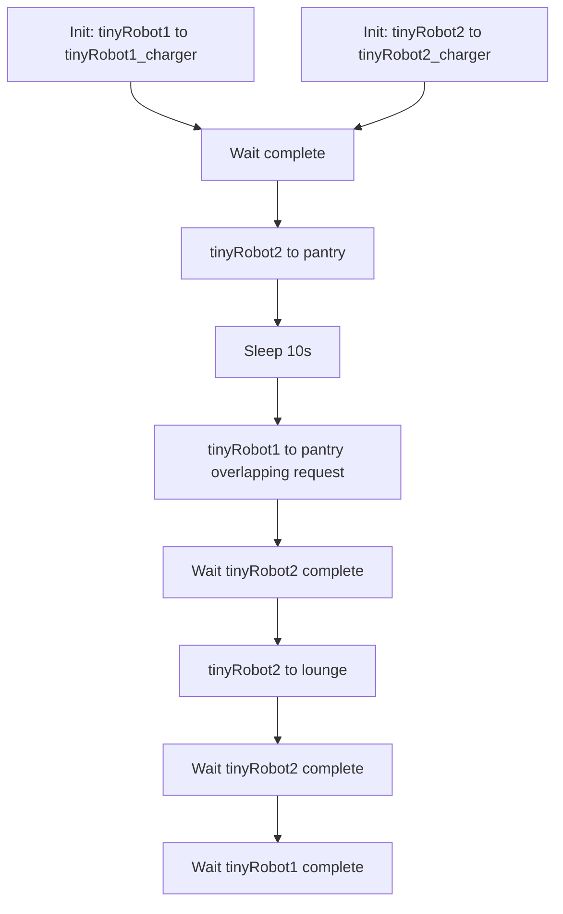
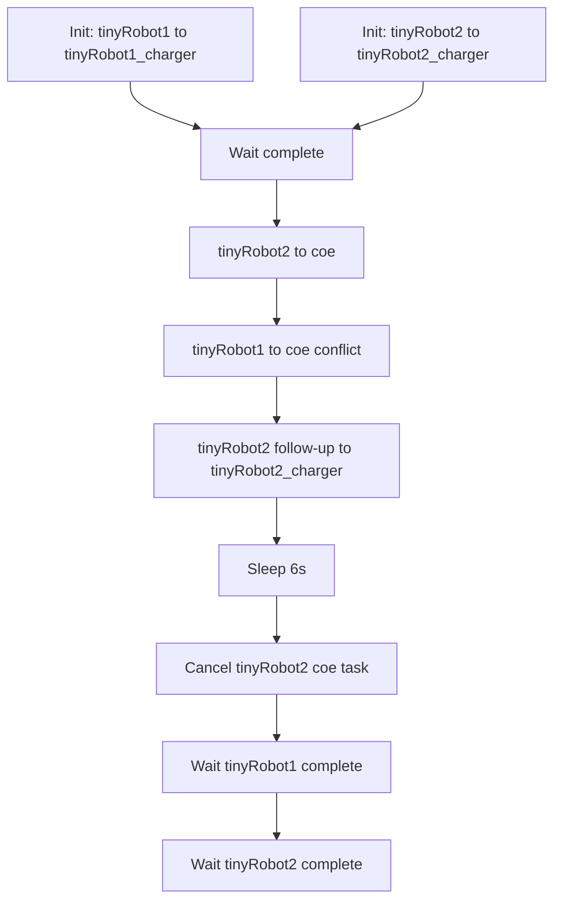
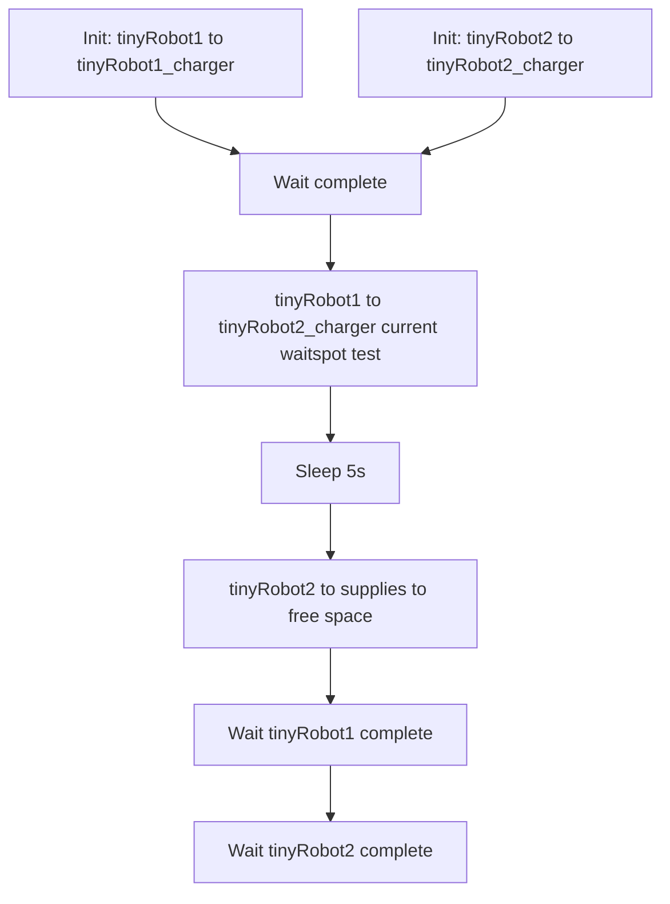
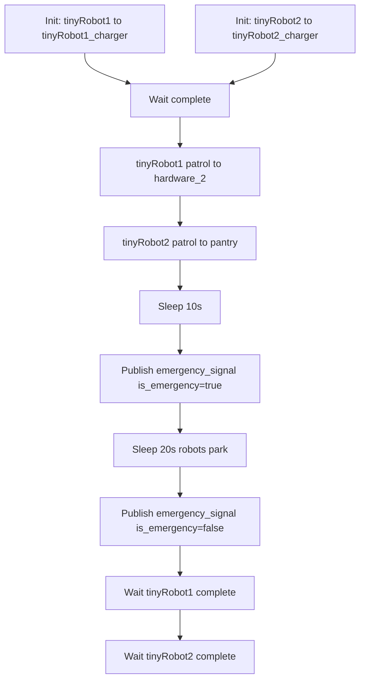
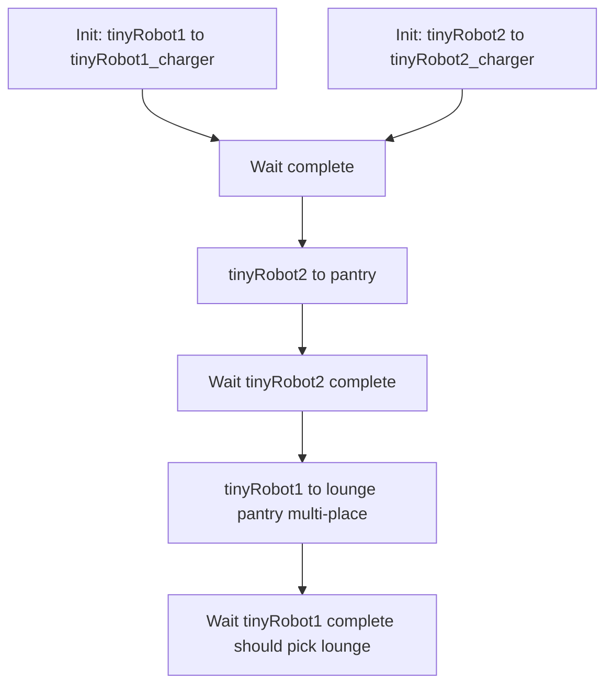
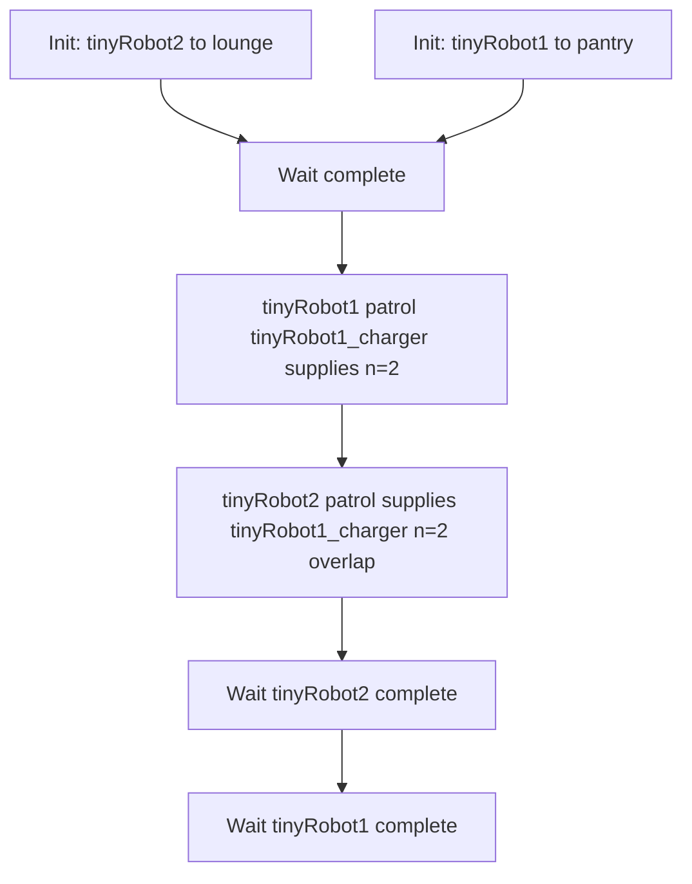
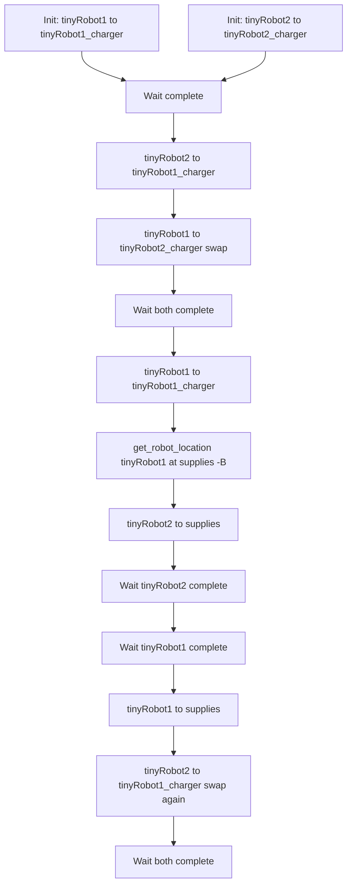

# Open-RMF High-Level Stress Tests

This folder contains bash scripts for high-level integration tests of Open-RMF. Each script initializes two tiny robots, dispatches tasks via `rmf_demos_tasks`, and verifies completion.

> [!NOTE]
> These stress tests are all based in `office` simulation.

## test_basic

Initializes tinyRobot1 and tinyRobot2 at their chargers, sends robot2 to pantry then overlaps robot1 to the same pantry after 10 s, then robot2 to lounge, verifying that Open-RMF resolves the first-come conflict and sequences the tasks without deadlock.

## test_cancellation

Initializes both robots at their chargers, creates a conflict for coe between robot2 then robot1 with a follow-up return task for robot2, cancels robot2’s coe task after 6 s and checks that cancellation frees the place for robot1 and both robots complete their remaining tasks.

## test_current_waitspot

Initializes both robots at their chargers, dispatches robot1 to tinyRobot2_charger so it can use its current location as a valid waitspot with finishing request set to nothing and supplies removed as parking, then sends robot2 to supplies to free space, verifying correct wait-spot allocation and completion.

## test_emergency_pullover

Initializes both robots at their chargers, starts patrols to hardware_2 and pantry, publishes emergency_signal is_emergency=true to force parking, waits, then publishes is_emergency=false and verifies both robots resume and finish their patrol tasks.

## test_multi_place

Initializes both robots at their chargers, sends robot2 to pantry and waits, then dispatches robot1 to a multi-place request lounge pantry and verifies Open-RMF picks lounge because pantry is occupied by robot2.

## test_patrol

Sets robot2 to lounge and robot1 to pantry, then issues overlapping patrols for both robots between tinyRobot1_charger ↔ supplies with n=2 and verifies the planner resolves the bidirectional use of shared places and both patrols complete.

## test_swap

Initializes both robots at their chargers, swaps them to each other's chargers, then later forces a position swap via charger/supplies moves using get_robot_location ... -B supplies semantics, verifying deadlock-free swapping and blocking behavior in Open-RMF.

